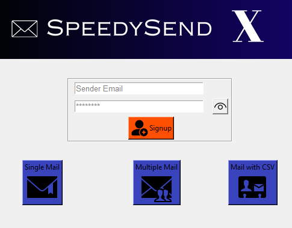

Here's a detailed README file template for your Email-Sender project:

---

# Email-Sender Project

## Overview
This Python-based GUI application allows users to send emails in three different modes:
1. **Individual Email**: Send an email to a single recipient.
2. **Multiple Emails**: Send the same email to multiple recipients.
3. **CSV File**: Load recipients from a CSV file and send bulk emails.

The project uses Python's Tkinter for the graphical interface and smtplib to handle email sending via SMTP. 

## Features
- **GUI Interface**: Easy-to-use graphical interface for non-technical users.
- **Send Emails in 3 Modes**:
  - Single email to one recipient.
  - Bulk emails to a list of recipients.
  - Import recipients from a CSV file for mass emailing.
- **Flexible Email Sending**: Easily adaptable to different email providers like Gmail, Yahoo, or custom SMTP servers.

## Technologies
- **Python**: Core programming language used.
- **Tkinter**: For building the GUI interface.
- **smtplib**: For sending emails using SMTP protocol.
- **CSV Handling**: Load recipients from a CSV file for bulk emails.

## Installation

1. **Clone the Repository**:
   ```bash
   git clone https://github.com/your-username/Email-Sender.git
   ```
   
2. **Navigate to the Project Directory**:
   ```bash
   cd Email-Sender
   ```

3. **Install Required Libraries** (if applicable):
   - You may need to install dependencies using the following:
     ```bash
     pip install -r requirements.txt
     ```

4. **Run the Application**:
   - Start the application with:
     ```bash
     python email_sender.py
     ```

## Usage
1. **Open the Application**: Once started, a GUI window will appear.
2. **Choose Email Sending Mode**:
   - **Individual Email**: Enter the recipient's email, subject, and message, then click "Send".
   - **Multiple Emails**: Input multiple email addresses separated by commas and send.
   - **CSV Emailing**: Upload a CSV file containing email addresses, and the program will handle sending to all listed contacts.
3. **Submit**: Click the respective "Send" button to dispatch the email(s).

## Screenshots
## Main Interface


## Settings Page


## Future Enhancements
- **Email Templates**: Ability to save and reuse email templates.
- **Enhanced Validation**: Improved checks for invalid email addresses and missing fields.
- **Scheduled Emails**: Option to schedule emails to be sent at a later time.

## License
This project is licensed under the MIT License.

---

Feel free to modify this template as needed and add your project details or screenshots! Let me know if you'd like help with any further adjustments.
